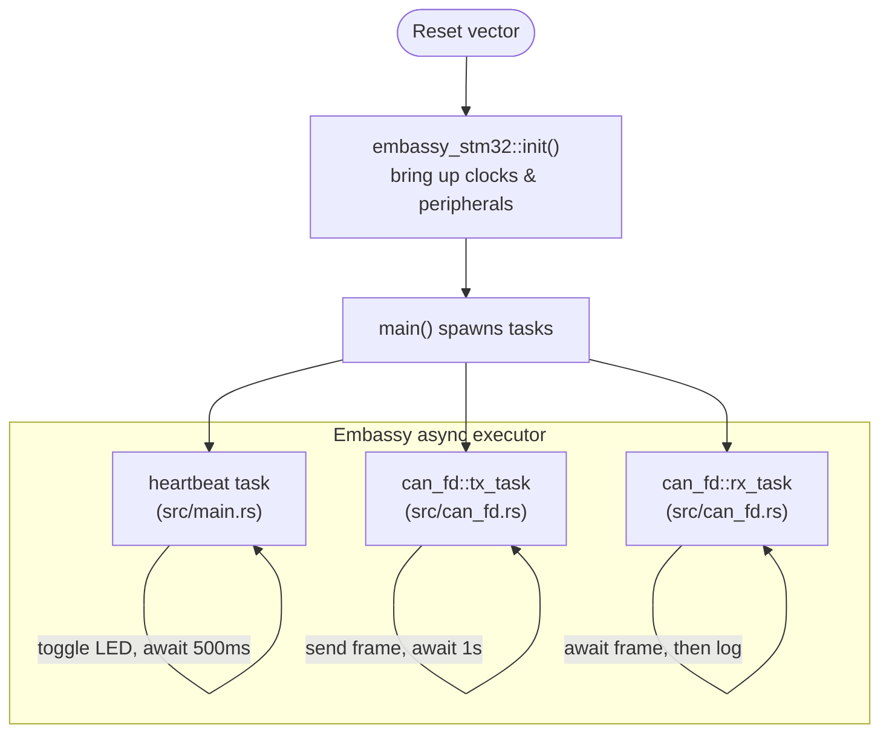

# rt-learn

A **production-grade, zero-warning template for learning modern automotive embedded Rust** on the
STMicroelectronics **NUCLEO-C562RE** development board (STM32C562RE MCU, Arm Cortex-M33F core).

The goal is not just "blink an LED" — it is to give you a **rigorous, safety-oriented environment**
that mirrors how embedded firmware is written in industry: pinned toolchains, strict linting,
supply-chain checks, and an `async` application structure built on the **Embassy** framework.

If you are new to Rust and/or embedded, read this whole file top to bottom. It explains not only
*what* each file does, but *why* it exists.

> **📚 Complete beginner?** The [`docs/`](docs/README.md) folder is a full, from-zero learning
> course: the automotive-embedded industry, the Rust language, `async`/Embassy, the hardware,
> CAN FD, this repo's architecture, every dependency, the build/flash flow, and the quality
> gates — each linked to official sources. Start at [`docs/README.md`](docs/README.md).

---

## 1. What are we building?

Two things run concurrently on the microcontroller:

1. **A heartbeat LED** that blinks forever — proof that the system is alive and the scheduler runs.
2. **An FDCAN (CAN FD) driver** that transmits a frame once per second and receives/logs any frames
   on the bus. CAN is *the* communication bus in cars, so this is the core automotive-relevant piece.

Everything is written in **`async` Rust** using **Embassy**, a framework that lets you write
cooperative multitasking firmware without a traditional RTOS.

### Hardware

| Item          | Value                                             |
| ------------- | ------------------------------------------------- |
| Board         | NUCLEO-C562RE                                      |
| MCU           | STM32C562RE (Arm Cortex-M33F, 144 MHz)            |
| Flash / RAM   | 512 KB @ `0x0800_0000` / 128 KB @ `0x2000_0000`  |
| Target triple | `thumbv8m.main-none-eabihf`                       |
| Debugger      | On-board ST-LINK (no external probe needed)        |

---

## 2. Core concepts (read this if you're new to embedded Rust)

Embedded Rust looks different from normal Rust. Here are the ideas you'll meet in this repo:

- **`#![no_std]`** — We cannot use the standard library (`std`) because there is no operating system
  underneath us. There's no heap allocator, no files, no threads by default. We only use `core`
  (the subset of Rust that needs no OS).
- **`#![no_main]`** — There is no OS to call a normal `main()`. The chip starts executing at a reset
  vector. Embassy's `#[embassy_executor::main]` macro sets that up for us.
- **The executor** — Embassy provides an `async` *executor* (scheduler). You write `async fn` tasks;
  the executor runs them, and when a task `.await`s something (a timer, a CAN frame), the CPU is free
  to run another task or sleep. This is **cooperative multitasking** — no preemption, no data races.
- **`defmt` + RTT logging** — `println!` doesn't exist on bare metal. `defmt` is a super-efficient
  logging framework; log strings stay on your PC and only tiny IDs are sent over **RTT** (a debug
  channel through the ST-LINK). You read them with `probe-rs`.
- **Panics** — When Rust panics on an MCU, there's nowhere to "crash to". `panic-probe` prints the
  panic over `defmt` and then halts. We also compile with `panic = "abort"` (no stack unwinding).
- **`flip-link`** — A linker wrapper that places the stack so that a **stack overflow triggers a
  hardware fault instead of silently corrupting your variables**. Cheap, important safety net.

---

## 3. Repository layout — which file does what

```
rt-learn/
├── .cargo/
│   └── config.toml          # HOW to build & flash: target, linker, probe-rs runner
├── .github/
│   └── workflows/
│       └── ci.yml           # Continuous Integration: fmt, clippy, build, cargo-deny
├── .vscode/
│   ├── settings.json        # Editor config: rust-analyzer target + on-save clippy
│   └── extensions.json      # Recommended extensions (rust-analyzer, probe-rs, TOML)
├── src/
│   ├── main.rs              # Entry point + lint gate + the LED heartbeat task
│   └── can_fd.rs            # The FDCAN driver module: init + TX task + RX task
├── build.rs                 # Build script: feeds memory.x to the linker
├── memory.x                 # The chip's memory map (flash/RAM addresses & sizes)
├── Cargo.toml               # Dependencies, build profiles, project metadata
├── Cargo.lock               # Exact resolved dependency graph — committed for repro builds
├── rust-toolchain.toml      # Pins the EXACT compiler version + components + target
├── rustfmt.toml             # Code formatting rules
├── clippy.toml              # Linter tuning
├── deny.toml                # Supply-chain policy (licenses, advisories, sources)
└── .gitignore               # What Git should ignore
```

### The two source files (the actual firmware)

#### `src/main.rs` — the entry point and the "wiring"

This is where the program starts. Its jobs:

1. **Declare the crate-wide rules** at the top (`#![no_std]`, `#![no_main]`, and the strict lints
   like `#![deny(unsafe_code)]`). These apply to *every* file in the crate, including `can_fd.rs`.
2. **`async fn main`** — initialize the hardware (`embassy_stm32::init`), create the LED, then
   **spawn** the three tasks onto the executor:
   - `heartbeat` (defined in this file),
   - `can_fd::tx_task` and `can_fd::rx_task` (defined in the other file).
3. **`heartbeat` task** — a `loop` that toggles the LED and `.await`s a timer. This is the simplest
   possible Embassy task and a good one to study first.

Think of `main.rs` as the **conductor**: it doesn't do much work itself, it starts the players.

#### `src/can_fd.rs` — the FDCAN driver module

All CAN logic is isolated here so the module is reusable and testable. It contains:

- **`mod irqs` + `bind_interrupts!`** — connects the chip's FDCAN interrupt lines to Embassy's
  handlers. This is the *only* place `unsafe` is allowed (the macro requires it), so it's fenced off
  with a local `#[allow(unsafe_code)]` while the rest of the crate stays `#![deny(unsafe_code)]`.
- **`init(...)`** — configures bit rates, sets an "accept-all" receive filter, starts the peripheral
  in normal mode, and **splits** it into two independent halves: a transmitter (`CanTx`) and a
  receiver (`CanRx`). Splitting lets TX and RX run in separate tasks safely.
- **`tx_task`** — every second, builds a CAN frame and sends it. Errors are logged, never panicked.
- **`rx_task`** — waits for incoming frames and logs their contents. Also error-tolerant.

> **Beginner note:** notice there are no `.unwrap()` calls inside the task loops. On a real device an
> `unwrap()` that fails would halt the whole system. Instead we `match` on results and log problems —
> this is the "safety-oriented" mindset the template is teaching.

### The build & memory files

| File                 | Responsibility |
| -------------------- | -------------- |
| `memory.x`           | Tells the linker *where* flash and RAM live and how big they are. Straight from the STM32C562RE datasheet. |
| `build.rs`           | A tiny program Cargo runs *before* compiling. It copies `memory.x` to a place the linker can find and re-runs when the memory map changes. |
| `.cargo/config.toml` | Sets the default build target, wires in `flip-link` and the linker scripts, and defines `cargo run` = flash via `probe-rs`. |
| `Cargo.toml`         | Lists dependencies (Embassy, defmt, etc.) and the compiler **profiles** (LTO, one codegen unit, `panic = "abort"` — all tuned for small, fast, predictable firmware). |

### The quality-gate files (what makes this "production-grade")

| File                  | Responsibility |
| --------------------- | -------------- |
| `rust-toolchain.toml` | Pins the **exact** Rust version + components + the MCU target, so every machine and CI runner builds identically. Kept recent enough to parse Embassy `main`'s edition-2024 manifests. |
| `rustfmt.toml`        | Formatting rules (100-column width, spaces). Enforced by `cargo fmt --check`. |
| `clippy.toml`         | Tunes Clippy (Rust's linter) so its strictest lints don't produce false positives on our domain words. |
| `deny.toml`           | Supply-chain policy for `cargo-deny`: only permissive licenses allowed, security advisories checked, only trusted dependency sources (crates.io + the pinned Embassy git repos). |
| `.github/workflows/ci.yml` | Runs the whole gate on every push/PR to `master`: **format → lint → build → license & security-advisory check** (via `cargo-deny`). |
| `.vscode/`            | Editor setup: `settings.json` points rust-analyzer at the MCU target and runs clippy on save; `extensions.json` recommends rust-analyzer, the probe-rs debugger, and a TOML extension. |

---

## 4. How the running system fits together



All three tasks share one CPU core. Whenever a task `.await`s (LED timer, TX timer, or "wait for a
CAN frame"), the executor runs another ready task or puts the core to sleep. No threads, no locks.

---

## 5. Getting started

### Install the tools (one-time)

```bash
# 1. Rust (rustup). The pinned toolchain in rust-toolchain.toml installs automatically.
curl --proto '=https' --tlsv1.2 -sSf https://sh.rustup.rs | sh

# 2. probe-rs — flashes the board and streams defmt logs over the ST-LINK.
cargo install probe-rs-tools

# 3. flip-link — stack-overflow-protecting linker (required by .cargo/config.toml).
cargo install flip-link

# 4. (optional) the supply-chain tool used by CI, to run the gate locally.
#    cargo-deny checks licenses, security advisories, bans, and sources.
cargo install cargo-deny
```

### Build

```bash
cargo build            # debug build for the MCU (target is preset, no --target needed)
cargo build --release  # optimized firmware image
```

### Flash & view logs

Plug the board in via USB, then:

```bash
cargo run --release    # flashes the board and prints defmt logs in your terminal
```

You should see the LED blinking and log lines like `CAN TX: id=0x100 seq=0`.

### Run the same checks CI runs

```bash
cargo fmt --all --check
cargo clippy --all-targets -- -D warnings
cargo build --release
cargo deny check
```

If all four pass locally, CI will pass too.

---

## 6. Important caveats (please read before touching hardware)

The STM32C5 series is **very new**. A couple of things worth knowing:

1. **Embassy source & toolchain (already handled).** The published `embassy-stm32` crate
   does not yet expose the `stm32c562re` chip feature, so `Cargo.toml` pulls Embassy from
   **git, pinned to an exact commit** (`rev = "…"`) with a committed `Cargo.lock` — builds
   are fully reproducible. Because Embassy `main` ships edition-2024 manifests, the
   toolchain is pinned to a recent stable in `rust-toolchain.toml` (an older Cargo cannot
   parse them). When you want newer Embassy, bump the `rev` **deliberately** (never a
   floating branch) and re-run the whole gate.
2. **Pin assignments (you must verify).** The template assumes the user **LED is on `PA5`**
   and **FDCAN1 uses `PB8` (RX) / `PB9` (TX)**. Check these against the NUCLEO-C562RE
   schematic and your CAN FD transceiver wiring, and adjust in `src/main.rs` /
   `src/can_fd.rs` if needed.

`cargo build --release` already succeeds against the pinned Embassy revision, so the whole
cloud CI gate is green. Before you flash real hardware, still confirm the pin assignments
above match your board and wiring.

---

## 7. Where to go next (learning path)

1. Read `src/main.rs` and change the LED blink interval (`HEARTBEAT_PERIOD`).
2. Read `src/can_fd.rs` and change the transmitted CAN ID or payload.
3. Add a third task (e.g. read a button with `embassy-stm32`'s `ExtiInput`).
4. Study how `.await` yields control — add `defmt::info!` logs to see the interleaving.

## License

Licensed under either of **MIT** or **Apache-2.0** at your option.
