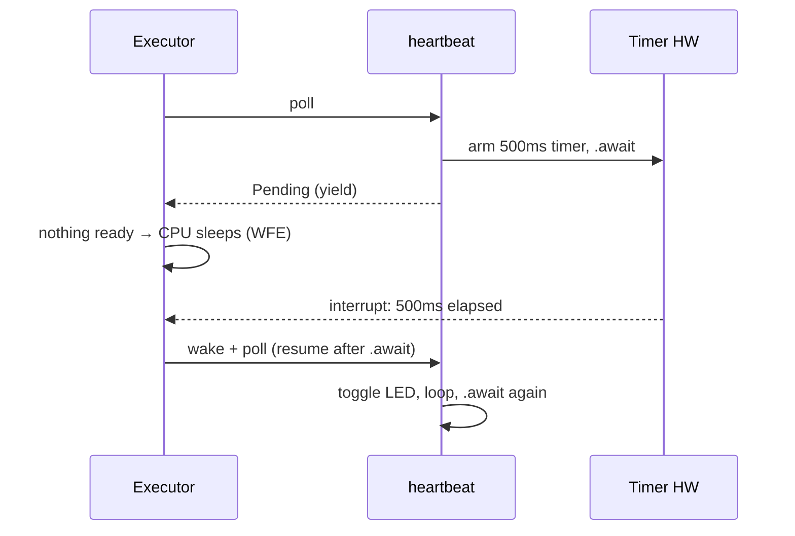
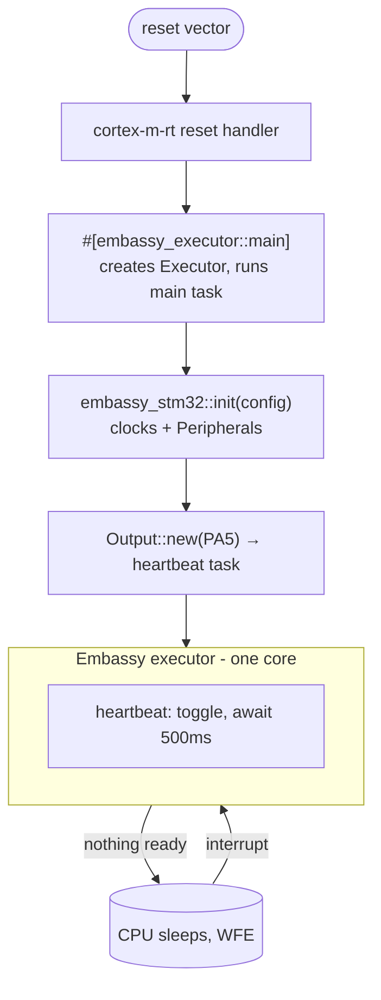

# 04 — `async`/`await` and the Embassy framework

This project runs a **heartbeat LED task** — and is built so you can add more tasks that all
run "at once" on a **single CPU core**, with **no operating system**, **no threads**, and
**no locks**. The magic that makes that possible is `async`/`await` plus the **Embassy**
executor. This doc explains both from scratch.

---

## 1. The problem: doing many things on one core

A microcontroller has (here) one CPU core. Yet real firmware must juggle many jobs:
blink an LED *and* watch a bus *and* read a sensor, seemingly simultaneously. Classic
approaches:

- **Superloop / polling** — one big `loop` that checks everything by hand. Simple, but it
  *busy-waits* (burns power) and gets tangled fast.
- **RTOS threads** — a Real-Time Operating System gives you preemptive threads. Powerful,
  but each thread needs its own stack (RAM you don't have), and shared data needs locks
  (mutexes), which invite deadlocks and races.

Embassy offers a third way: **cooperative `async` tasks**. You write code that *looks*
sequential, and it pauses at well-defined points to let other work run. No per-thread
stacks, no preemption, no locks needed for the common cases.

---

## 2. What `async` actually is

An `async fn` is a function that can **pause and resume**. Calling it does **not** run it;
it returns a **future** — a value describing work-in-progress. The future does nothing
until something *drives* it (the executor).

Inside an `async fn`, the keyword **`.await`** means:

> "This operation might not be done yet. If it isn't, **pause me here and let other tasks
> run**. Wake me and resume from this exact point when it *is* ready."

The compiler performs a remarkable transformation: it turns your straight-line `async`
code into a **state machine**. Each `.await` becomes a state where the function can be
suspended. All the local variables that must survive across the pause are stored inside the
future. When resumed, it jumps back to the right state and continues. You get the *ergonomics*
of sequential code with the *behavior* of an event-driven machine — and it's computed at
compile time, so there's no runtime interpreter and (per the Embassy executor docs) **no
heap allocation**: each task's state machine is a `static` sized exactly at compile time.

```rust
async fn heartbeat(mut led: Output<'static>) {
    loop {
        led.toggle();                          // do work
        Timer::after(HEARTBEAT_PERIOD).await;  // PAUSE here for 500ms; others run
    }                                          // resume, loop again
}
```

Between the `.await` and the timer firing, this task is *suspended* — it uses zero CPU. The
core is free to run any other task, or to **sleep** to save power.

---

## 3. The executor: Embassy's scheduler

A future is inert; something must poll it to make progress. That something is the
**executor** (a.k.a. runtime/scheduler). Per the
[Embassy executor docs](https://docs.rs/embassy-executor/latest/embassy_executor/), it
works like this:

1. When a task is created, the executor **polls** it — runs it until it would block.
2. The task makes progress until it hits an `.await` on something not ready. It then
   yields by returning **`Poll::Pending`**.
3. The executor moves on and polls the next ready task.
4. When there's nothing to do, the executor puts the CPU to sleep (on Cortex-M, using the
   `WFE`/`WFI` "wait for event/interrupt" instructions) — **no busy-looping**.
5. An event (e.g. a timer expiring) fires a hardware **interrupt**, which
   **wakes** exactly the task waiting on it. Only the woken task is re-polled, not all of them.

Key properties from the official docs, and why they matter here:

- **No heap, statically allocated tasks.** If your tasks don't fit in RAM, it's a *link-time*
  error, not a runtime crash. Perfect for safety-critical work.
- **Cooperative, not preemptive.** A task runs until *it* chooses to `.await`. This means no
  task can be interrupted mid-update of shared data → **no data races**, so most sharing
  needs no mutex at all. The trade-off: a task that never `.await`s (e.g. a busy `loop {}`
  with no yield) would **starve** the others. Rule: don't block; `.await` instead.
- **Fair.** A constantly-woken task can't monopolize the CPU; others get a turn first.
- **Power-efficient.** Idle = the core actually sleeps.



(With one task the picture is simple; add more `async fn` tasks and the executor interleaves
them the same way — each yields at its `.await`, each is woken by its own event.)

---

## 4. Embassy, the framework

[Embassy](https://embassy.dev/book/) ("**Emb**edded **async**") is a whole ecosystem of
crates that make `async` a first-class option for embedded. This project uses three of them:

| Crate | Role here | Doc 07 detail |
| ----- | --------- | ------------- |
| **`embassy-executor`** | The async scheduler + the `#[main]`/`#[task]` macros | §on executor |
| **`embassy-time`** | `Timer`, `Duration`, `Instant` — hardware-timer-backed delays | §on time |
| **`embassy-stm32`** | The **HAL**: safe drivers for GPIO, clocks, timers, interrupts | §on HAL |

Embassy also provides `embassy-sync` (channels, mutexes for when you *do* need to share),
`embassy-net`, `embassy-usb`, and more — not used here, but good to know they exist.

### The abstraction layers (why the code is so clean)

Embassy stacks three layers over the raw silicon. The [Embassy book's "From bare metal to
async Rust"](https://embassy.dev/book/) walks the same ladder:

```
your async tasks         ← what you write (main.rs)
        │
embassy-stm32  (HAL)     ← safe types: Output (GPIO), Timer, …
        │
stm32-metapac  (PAC)     ← typed register access, auto-generated per chip
        │
raw registers            ← memory-mapped hardware (never touched directly here)
```

Writing at the **HAL** level (what this repo does) means you say `led.toggle()` instead of
computing a bitmask and writing a GPIO register by hand. The HAL also auto-enables
peripheral clocks and applies correct register sequences for *this specific chip* — which
is why chip support matters so much (Doc 05/07).

---

## 5. The two macros, decoded

### `#[embassy_executor::main]`

Applied to `async fn main(spawner: Spawner)`. Per the Embassy book, this macro:

1. Creates an `Executor` instance.
2. Defines the real cortex-m-rt entry point (recall `#![no_main]` from Doc 03).
3. Starts the executor and spawns your `main` as its first task, handing it a **`Spawner`**.

The `Spawner` is your handle to launch more tasks. That's why `main` isn't special beyond
being "the first task" — it initializes hardware and spawns the others.

> **Feature flags matter.** `embassy-executor` needs `platform-cortex-m` (the Cortex-M
> platform, formerly `arch-cortex-m`) and `executor-thread` for `#[main]` to exist. Those
> are set in `Cargo.toml`; omitting them gives the confusing "could not find `main`" error.
> This repo already has them (Doc 07).

### `#[embassy_executor::task]`

Applied to an `async fn`, it turns it into a spawnable task. Constraints (from the docs):

- A task **cannot take generic parameters** (its storage must be a concrete, fixed size).
- Its arguments must be `'static` (Doc 02) — it may run forever.
- Its storage is a compile-time-sized `static`; spawning it more than its `pool_size`
  (default 1) fails.

In this repo the task functions return a spawn token that you pass to `spawner.spawn(…)`.
Because spawning *can* fail (e.g. pool exhausted), the idiom wraps it in `unwrap!`:

```rust
spawner.spawn(unwrap!(heartbeat(led)));
```

At **startup**, a failure to spawn is genuinely unrecoverable, so panicking (via the
`defmt` `unwrap!`) is the right call — contrast the run-loop rule from Doc 02.

---

## 6. Interrupts and how a task wakes up

A peripheral signals "I have news" by raising a hardware **interrupt** — the CPU stops what
it's doing and jumps to a handler via the vector table (Doc 03). Embassy uses interrupts as
the wake source for `async`. The heartbeat's timer is the simplest example:

1. `heartbeat` calls `Timer::after(…).await` — the deadline isn't reached yet, so it yields;
   the core may sleep.
2. The hardware timer counts down and, when it expires, raises a timer interrupt.
3. Embassy's time-driver handler runs and **wakes** the `heartbeat` task.
4. The executor re-polls `heartbeat`, which resumes right after the `.await`.

The same mechanism drives *any* peripheral. When you add an interrupt-driven peripheral of
your own (say a button on an EXTI line, or a UART), you connect its interrupt vectors to
Embassy's handlers with the **`bind_interrupts!`** macro. Because generating interrupt-vector
bindings is inherently `unsafe`, you fence it in a tiny module with a **local**
`#[allow(unsafe_code)]`, keeping a crate-wide `#![deny(unsafe_code)]` intact (Doc 09):

```rust
#[allow(unsafe_code)]
mod irqs {
    embassy_stm32::bind_interrupts!(pub struct Irqs {
        // e.g. an EXTI line or a UART → its Embassy interrupt handler
    });
}
```

That `Irqs` struct is then handed to the peripheral's constructor so the HAL knows which
handlers to use. (This template's heartbeat needs none of this — the time driver wires its
own timer interrupt — so the crate stays 100% safe, with zero `unsafe`.)

---

## 7. Tasks vs. one task with `select`/`join`

The Embassy FAQ notes two ways to be concurrent: **multiple tasks** or **one task driving
several futures** with `join`/`select`. This template currently runs a single task
(`heartbeat`), but as you add work you can pick either model. Separate tasks are simplest to
reason about and let each own its peripheral outright — a natural fit when, say, a second
task drives another pin.

---

## 8. Full boot-to-running picture



**Next:** [05-the-hardware.md](05-the-hardware.md) — the chip these tasks actually run on.

---

### Where to go deeper (official)

- [Embassy Book](https://embassy.dev/book/) — especially "For beginners" and "Embassy executor".
- [`embassy-executor` API docs](https://docs.rs/embassy-executor/latest/embassy_executor/) — features, platforms, `#[main]`/`#[task]`.
- [`embassy-time` API docs](https://docs.rs/embassy-time/latest/embassy_time/) — `Timer`, `Duration`, `Instant`.
- [Async Rust in "The Book"](https://doc.rust-lang.org/book/ch17-00-async-await.html) — language-level `async`/`await`.
