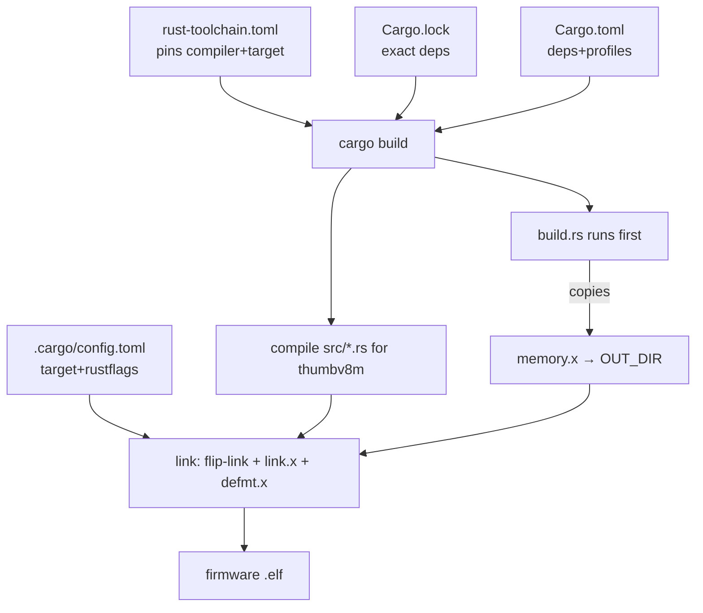
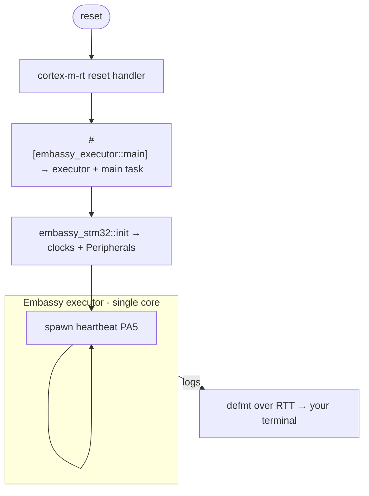

# 06 — Architecture: why the repo looks like this

Now that you understand the language (Doc 02), bare metal (Doc 03), async/Embassy (Doc 04),
and the chip (Doc 05), this doc connects it all: **what each file is, why it
exists, and how they interact at build time and run time.**

---

## 1. The guiding principles

Every structural choice serves one of these goals (all rooted in Doc 01):

1. **Safety first** — the compiler and tooling should catch mistakes, not the car.
2. **Determinism / reproducibility** — the same source must always produce the same firmware.
3. **Separation of concerns** — each file/module has one clear job.
4. **No surprises at runtime** — no heap, no panics in hot paths, no silent failures.

---

## 2. The file map

```
rt-learn/
├── .cargo/config.toml       # HOW to build & flash (target, linker, probe-rs runner)
├── .github/workflows/ci.yml # CI gate: fmt → clippy → build → cargo-deny
├── .vscode/                 # editor: rust-analyzer target + clippy on save
├── src/
│   └── main.rs              # entry point, lint gate, heartbeat task
├── build.rs                 # build script: feeds memory.x to the linker
├── memory.x                 # chip memory map (flash/RAM addresses & sizes)
├── Cargo.toml               # dependencies + build profiles + metadata
├── Cargo.lock               # exact resolved dependency graph (committed!)
├── rust-toolchain.toml      # pins the exact compiler + components + target
├── rustfmt.toml             # formatting rules
├── clippy.toml              # linter tuning
├── deny.toml                # supply-chain policy (licenses/advisories/sources)
└── README.md                # human-facing overview
```

Group them by *purpose*:

| Purpose | Files | Covered in |
| ------- | ----- | ---------- |
| **The firmware** | `src/main.rs` | §3–4 here |
| **Build & memory** | `.cargo/config.toml`, `build.rs`, `memory.x`, `Cargo.toml` | Doc 03, Doc 08 |
| **Reproducibility** | `Cargo.lock`, `rust-toolchain.toml` | Doc 08, Doc 09 |
| **Quality gates** | `rustfmt.toml`, `clippy.toml`, `deny.toml`, `ci.yml` | Doc 09 |
| **Editor** | `.vscode/` | Doc 08 |

---

## 3. Why one source file (for now)

The firmware today is a single **conductor**:

- **`src/main.rs` — the conductor.** It owns the crate-wide rules and the *wiring*. It
  initializes hardware and starts the players (currently one: the heartbeat). Keeping the
  entry point thin makes the system's shape obvious at a glance.

This is the smallest honest starting point. As the firmware grows, the natural pattern is a
thin top-level orchestrator plus **one module per subsystem** — if you later add, say, a
`sensors.rs`, you'd declare it with `mod sensors;` and it slots in cleanly.

### `main.rs` responsibilities, in order

1. **Crate-wide attributes** (Doc 03 + Doc 09): `#![no_std]`, `#![no_main]`, and the strict
   lint gate (`deny(unsafe_code)`, clippy levels, plus the few justified `allow`s). These
   apply to *every* module. The crate has **zero `unsafe`**, so `deny(unsafe_code)` has no
   exceptions.
2. **`async fn main`** — `embassy_stm32::init(...)`, create the LED, then **spawn** the
   `heartbeat` task via the `Spawner` (Doc 04).
3. **`heartbeat` task** — the simplest possible Embassy task; a good first thing to study.

---

## 4. How the pieces interact — two views

### Build-time (how source becomes firmware)



`Cargo.toml` + `Cargo.lock` + `rust-toolchain.toml` decide *exactly* what compiles;
`build.rs` + `memory.x` + `.cargo/config.toml` decide *how it's laid out and linked*
(Doc 03, Doc 08). Result: a deterministic `.elf`.

### Run-time (how firmware behaves on the chip)



(Detailed in Doc 04.)

---

## 5. Why ownership drives the architecture

A subtle but important point: the structure isn't just style — it's **enforced by Rust's
ownership** (Doc 02/03):

- `embassy_stm32::init` yields a `Peripherals` struct owning every peripheral once.
- `main` *moves* `PA5` into `heartbeat` — after that, nothing else in the program can touch
  that pin.

So each task **exclusively owns** its hardware. When you add more tasks, no two can touch
the same peripheral — which means no locks are needed and hardware-conflict bugs become
*compile errors*. The task boundaries and the ownership boundaries are the same boundaries.
That's the "freedom from interference" idea from Doc 01, made structural.

---

## 6. Why the config files are first-class citizens

In many hobby projects the "real code" is `main.rs` and everything else is noise. Here the
config files are *the point* — they're what makes the firmware production-grade:

| File | The single question it answers |
| ---- | ------------------------------ |
| `rust-toolchain.toml` | *Which exact compiler builds this?* |
| `Cargo.lock` | *Which exact dependency versions?* |
| `Cargo.toml` (profiles) | *How is it optimized/linked?* |
| `memory.x` | *Where does code/data live on the chip?* |
| `.cargo/config.toml` | *What target, linker, and run command?* |
| `clippy.toml` / `rustfmt.toml` | *What does "clean code" mean here?* |
| `deny.toml` | *Which dependencies/licenses are allowed?* |
| `ci.yml` | *What must pass before code is accepted?* |

Together they answer: *"Can a stranger, years from now, rebuild the byte-identical firmware
and trust it?"* — the reproducibility goal from Doc 01. Each is dissected in Docs 07–09.

**Next:** [07-dependencies.md](07-dependencies.md) — every crate, and why it's there.
