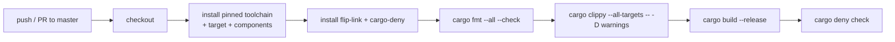

# 09 — Quality gates: what makes this "production-grade"

A blinking LED can be written in ten sloppy lines. This project is the opposite: a strict,
reproducible, auditable setup that mirrors safety-critical practice (Doc 01). This doc
explains the **lint gate** in the source, and the four config files that enforce quality:
[`rustfmt.toml`](../rustfmt.toml), [`clippy.toml`](../clippy.toml), [`deny.toml`](../deny.toml),
and [`.github/workflows/ci.yml`](../.github/workflows/ci.yml) — plus the reproducibility
story (`Cargo.lock` + toolchain).

---

## 1. The lint gate at the top of `main.rs`

**Lints** are compiler/Clippy checks that flag suspicious or non-idiomatic code. This crate
opts into an aggressive set, applied crate-wide:

```rust
#![deny(unsafe_code)]      // no `unsafe` anywhere (compile error if used)
#![deny(clippy::all)]      // all default Clippy lints → errors
#![warn(clippy::pedantic)] // stricter, opinionated lints → warnings
#![warn(clippy::nursery)]  // experimental lints → warnings
#![warn(clippy::cargo)]    // Cargo.toml hygiene lints → warnings
```

- **`deny` vs `warn`** — `deny` makes a violation a hard error (build fails); `warn` just
  prints. In CI, `clippy -- -D warnings` promotes *all* warnings to errors, so even the
  `warn` lints must be clean (§4).
- **`deny(unsafe_code)`** — the flagship rule. `unsafe` disables some of Rust's compile-time
  checks; forbidding it means the whole crate enjoys full memory-safety guarantees (Doc 01).
  This template contains **zero** `unsafe`, so the gate has **no exceptions** anywhere.

### The justified exceptions

Zealotry without judgment is a bug. The crate documents a few precise `allow`s, each with a
reason (this *is* the professional pattern — narrow, explained exceptions):

| Exception | Where | Why |
| --------- | ----- | --- |
| `#![allow(clippy::multiple_crate_versions)]` | `main.rs` | Embedded dep trees (Embassy + PAC + HAL) legitimately pull duplicate transitive versions we can't control; `cargo-deny` still surfaces them as a `warn` (§3). |
| `#![allow(clippy::future_not_send)]` | `main.rs` | The thread-mode executor is single-core; its task futures capture the `!Send` `Spawner` on purpose. The nursery lint doesn't apply to this model. (Doc 04) |

The lesson: strict by default, with a *small* number of *documented* opt-outs — not a wall
of blanket `allow`s.

---

## 2. Formatting — `rustfmt.toml`

**rustfmt** auto-formats code to a canonical style, so diffs are about *logic*, not spacing,
and every contributor's code looks identical. Key settings:

```toml
edition = "2021"
max_width = 100          # hard line-length ceiling
hard_tabs = false        # spaces, never tabs
tab_spaces = 4
newline_style = "Unix"   # LF only
reorder_imports = true   # deterministic import order
use_field_init_shorthand = true
use_try_shorthand = true # prefer `?` over match-return
```

Only **stable** options are enabled so the pinned stable toolchain formats without "unstable
feature" warnings. The file also lists (commented out) the extra nightly-only options the
project *would* enforce under `cargo +nightly fmt` (like import grouping). CI runs
`cargo fmt --all --check`, which **fails** if any file isn't already formatted — you can't
merge unformatted code.

---

## 3. Linter tuning — `clippy.toml`

Clippy's strictest lints can produce **false positives** on domain vocabulary. `clippy.toml`
tunes that without weakening real checks:

```toml
doc-valid-idents = ["..", "STMicroelectronics", "STM32C562RE", "STM32C5",
                    "NUCLEO-C562RE", "RTT", "GPIO"]
```

The pedantic `doc_markdown` lint flags identifiers in doc comments that "look like code" but
aren't in backticks. Domain acronyms (GPIO, RTT…) would trip it constantly. This
extends (via `".."`) Clippy's built-in allow-list with our terms, so docs read naturally and
the lint still catches genuine mistakes. Tuning > disabling.

---

## 4. Supply-chain policy — `deny.toml`

`cargo-deny` audits your **dependency tree** for legal and security risk — critical when
your firmware pulls dozens of transitive crates (Doc 07). It checks four things:

### Advisories (security)

```toml
[advisories]
version = 2
db-urls = ["https://github.com/rustsec/advisory-db"]
ignore = ["RUSTSEC-2026-0110"]  # bare-metal unmaintained via cortex-m 0.7; no fix yet, documented
```

Checks every crate against the **RustSec** vulnerability database. In v2, any advisory is an
error unless explicitly `ignore`d **with a written justification** — here the one ignore is
the unmaintained `bare-metal` transitive crate (Doc 07), with a note to re-review when
cortex-m drops it. This replaces a separate `cargo audit` step (which would collide with
cargo-deny over the shared advisory DB and is redundant).

### Licenses

```toml
[licenses]
version = 2
allow = ["MIT", "Apache-2.0", "BSD-2-Clause", "BSD-3-Clause", "ISC", "Zlib",
         "CC0-1.0", "Unicode-3.0", "Unicode-DFS-2016", …]
```

A **permissive-only allow-list**: any dependency whose license isn't listed **fails the
build**. Strong/viral copyleft (GPL/AGPL/LGPL) is deliberately absent — pulling such a
dependency into shippable firmware could impose obligations you don't want, so it's blocked
at the gate. (Our own unpublished crate is exempted via `[licenses.private] ignore = true`.)

### Bans (duplicates & wildcards)

```toml
[bans]
multiple-versions = "warn"   # duplicate crate versions: reviewable, not fatal (embedded trees dup a lot)
wildcards = "deny"           # forbid `*` version requirements → every dep is pinnable
```

`wildcards = "deny"` is why `Cargo.toml` keeps an explicit `version = "…"` next to each git
`rev` (Doc 07). `multiple-versions = "warn"` matches the `clippy::multiple_crate_versions`
allow (§1): unavoidable in embedded, so surfaced not blocked.

### Sources

```toml
[sources]
unknown-registry = "deny"
unknown-git = "deny"
allow-git = ["https://github.com/embassy-rs/embassy",
             "https://github.com/embassy-rs/stm32-data-generated"]
```

Only **crates.io** and the two **trusted Embassy git repos** are allowed. A dependency
sneaking in from some random git URL fails the check — a supply-chain guardrail. The second
URL is needed because `stm32-metapac` comes from `stm32-data-generated` (Doc 05/07).

---

## 5. Continuous Integration — `ci.yml`

**CI** runs the whole gate automatically on every push/PR to `master`, so nothing
unreviewed or broken lands. The pipeline:



Notable details baked in (from the workflow + repo memory):

- **Toolchain from `rust-toolchain.toml`** — CI reads the same pinned channel/components you
  use locally, and additionally guarantees the `thumbv8m.main-none-eabihf` target is present.
- **`-D warnings`** — promotes every Clippy warning (including the `pedantic`/`nursery`
  `warn` lints from §1) to an error. "Zero-warning" is literal.
- **No global `RUSTFLAGS`** — CI must not set it, or it would override the `.cargo/config.toml`
  rustflags (flip-link + linker scripts) and break the release link (Doc 08). Warnings are
  gated only via the clippy step.
- **No separate `cargo audit`** — `cargo deny check`'s advisories cover the same RustSec DB;
  running both collides on the shared `~/.cargo/advisory-db` directory.
- **Branch is `master`** — the workflow triggers on `master`, the repo's default branch.
- **Concurrency cancel** — superseded runs on the same ref are cancelled to save CI minutes.

---

## 6. Reproducibility — the quiet guarantee

Three things together make the firmware **byte-for-byte reproducible** — the automotive
requirement from Doc 01 ("rebuild the exact image years later and trust it"):

1. **`rust-toolchain.toml`** — pins the *exact* compiler + components (Doc 08).
2. **`Cargo.lock`** (committed) — pins the *exact* version of every crate, including the
   Embassy git `rev` and all transitive deps.
3. **Deterministic build settings** — `codegen-units = 1` + LTO in the profiles (Doc 07)
   remove build-parallelism-induced variation.

Change any dependency? `Cargo.lock` changes, the diff is visible in review, and CI re-runs
the whole gate. Nothing drifts silently.

---

## 7. The mindset to take away

| Practice here | The habit it teaches |
| ------------- | -------------------- |
| `deny(unsafe_code)` + fenced exceptions | Prove safety; make each exception explicit and justified |
| No `unwrap()` in run loops (Doc 02) | Fail loud at boot, stay alive in operation |
| `overflow-checks = true` (Doc 07) | Catch arithmetic bugs; mark intended wrapping explicitly |
| Permissive-only licenses, trusted sources | Know and control your supply chain |
| Pinned toolchain + `Cargo.lock` | Reproducible, auditable builds |
| Zero-warning CI gate | Ship code that passes review, not just compiles |

These are exactly the disciplines that scale from a learning LED to a certified ECU.

**Next:** [10-glossary.md](10-glossary.md) — every term defined · [11-references.md](11-references.md) — all sources.

---

### Where to go deeper (official)

- [Clippy lint list & configuration](https://doc.rust-lang.org/clippy/) — every lint, `clippy.toml` options.
- [rustfmt configuration](https://rust-lang.github.io/rustfmt/) — all formatting options.
- [cargo-deny book](https://embarkstudios.github.io/cargo-deny/) — advisories, licenses, bans, sources.
- [RustSec advisory database](https://rustsec.org/) — the vulnerability DB cargo-deny audits against.
- [The Cargo book → `Cargo.lock` & reproducibility](https://doc.rust-lang.org/cargo/guide/cargo-toml-vs-cargo-lock.html).
