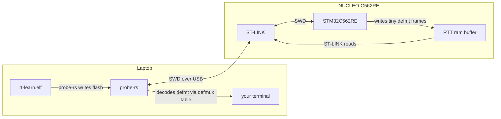

# 09 — Toolchain, build, flashing, and logging

This doc is the practical one: the tools you install, what happens when you type
`cargo build`, how the firmware gets *onto* the chip, and how logs get *back*. It ties
together [`rust-toolchain.toml`](../rust-toolchain.toml),
[`.cargo/config.toml`](../.cargo/config.toml), [`build.rs`](../build.rs), and the `defmt`
stack from Doc 08.

---

## 1. The toolchain — `rust-toolchain.toml`

Rust is installed via **rustup**, which can manage multiple compiler versions ("toolchains").
This repo *pins* one so everyone builds identically:

```toml
[toolchain]
channel = "1.97.1"
components = ["rust-src", "llvm-tools", "clippy", "rustfmt"]
targets = ["thumbv8m.main-none-eabihf"]
profile = "minimal"
```

- **`channel = "1.97.1"`** — the exact compiler version. Pinning is a hard requirement for
  reproducible, safety-relevant builds (Doc 01): every developer and CI runner uses
  byte-identical tooling. It must also be **recent enough** to parse Embassy `main`'s
  edition-2024 manifests — an older Cargo fails with "invalid inline table" errors (this is
  why it's 1.97.1 and not something older).
- **`components`** — extra tools installed with the compiler:
  - **`rust-src`** — the source of `core`, needed to build/inspect it for bare metal.
  - **`llvm-tools`** — `objcopy`/`size`/`nm` etc. (via `cargo-binutils`) and `defmt` tooling.
  - **`clippy`** — the linter (Doc 10).
  - **`rustfmt`** — the formatter (Doc 10).
- **`targets`** — pre-install the cross-compilation target `thumbv8m.main-none-eabihf`
  (Doc 03) so `cargo build` just works.
- **`profile = "minimal"`** — install only what's listed, nothing extra.

Just being *in* this directory makes rustup switch to this toolchain automatically.

---

## 2. One-time tool installation

Beyond the toolchain, you need a few host tools (from the README):

```bash
# Rust itself (installs the pinned toolchain automatically when you enter the repo)
curl --proto '=https' --tlsv1.2 -sSf https://sh.rustup.rs | sh

# probe-rs: flashes the board and streams defmt logs over the ST-LINK
cargo install probe-rs-tools

# flip-link: stack-overflow-protecting linker (required by .cargo/config.toml)
cargo install flip-link

# cargo-deny (optional locally): the supply-chain gate CI runs (Doc 10)
cargo install cargo-deny
```

- **`probe-rs`** — the modern, all-Rust tool that talks to debug probes (here the on-board
  ST-LINK) to flash firmware and read RTT logs. It replaces older tools like OpenOCD +
  gdb for most workflows.
- **`flip-link`** — the linker wrapper for stack-overflow protection (Doc 03).

---

## 3. Build configuration — `.cargo/config.toml`

This file tells Cargo *how* to build and run for this board:

```toml
[build]
target = "thumbv8m.main-none-eabihf"          # default target → plain `cargo build` cross-compiles

[target.thumbv8m.main-none-eabihf]
runner = "probe-rs run --chip STM32C562RE"    # `cargo run` = flash + log via probe-rs

rustflags = [
    "-C", "linker=flip-link",                 # stack-overflow protection (Doc 03)
    "-C", "link-arg=-Tlink.x",                # cortex-m-rt's linker script (consumes memory.x)
    "-C", "link-arg=-Tdefmt.x",               # defmt's log-string interning table
    "-C", "link-arg=--nmagic",                # disable page alignment; needed by flip-link, keeps image compact
]

[env]
DEFMT_LOG = "debug"                           # compile-time log verbosity
```

Line by line:

- **`[build] target`** — makes the MCU triple the default, so you never type `--target`.
- **`runner`** — defines what `cargo run` executes: `probe-rs run --chip STM32C562RE`. That
  one command flashes the freshly built `.elf` and then streams its logs. The `--chip` must
  match the `stm32c562re` HAL feature (Doc 08).
- **`rustflags`** — flags passed to every compile/link:
  - **`linker=flip-link`** — use flip-link instead of the default linker (Doc 03).
  - **`-Tlink.x`** — use cortex-m-rt's master linker script (which `INCLUDE`s `memory.x`).
  - **`-Tdefmt.x`** — link defmt's interning table so log strings can be reconstructed on
    the host. Missing this breaks `defmt`.
  - **`--nmagic`** — turn off page-alignment of sections; required for flip-link's layout and
    keeps the flash image small.
- **`[env] DEFMT_LOG`** — sets the **compile-time** log level. `defmt` filters logs *at
  compile time* (like `RUST_LOG` but zero-cost): with `debug`, `trace!` calls are compiled
  out entirely. Override per run, e.g. `DEFMT_LOG=info cargo run --release`.

> **CI caveat (Doc 10):** these `rustflags` live in `.cargo/config.toml`, **not** in a global
> `RUSTFLAGS` env var. Setting `RUSTFLAGS` in CI would *override* (not extend) these and
> break the link. So CI never sets `RUSTFLAGS`.

---

## 4. What `cargo build` actually does

```mermaid
flowchart TD
    A[cargo build] --> B[rustup selects 1.97.1 toolchain]
    B --> C[resolve deps from Cargo.lock]
    C --> D[run build.rs FIRST]
    D --> E[build.rs copies memory.x → OUT_DIR, adds it to link search path]
    C --> F[compile core + all crates + src/*.rs for thumbv8m]
    F --> G[link: flip-link + -Tlink.x(+memory.x) + -Tdefmt.x + --nmagic]
    E --> G
    G --> H[target/thumbv8m.../debug/rt-learn  (ELF)]
```

The output is an **ELF** file — an executable format containing the machine code, the memory
layout, *and* the debug/defmt info. The debug info stays in the ELF on your PC; only the
code+data are written to the chip's flash.

Common commands:

```bash
cargo build              # debug build for the MCU
cargo build --release    # optimized (size) build (Doc 08 profiles)
cargo run --release      # build + flash + stream logs (via the probe-rs runner)
```

---

## 5. Flashing and logging — the round trip



1. `cargo run` builds the ELF and hands it to `probe-rs run --chip STM32C562RE`.
2. `probe-rs` talks to the **ST-LINK** over USB using **SWD** (Serial Wire Debug, Arm's 2-pin
   debug protocol), erases the relevant flash sectors, writes your program, and resets the chip.
3. The firmware runs. Every `info!`/`warn!` writes a compact **defmt** frame (indices + raw
   bytes) into the **RTT** RAM buffer (Doc 08).
4. `probe-rs` continuously reads that buffer over SWD and uses the `defmt.x` interning table
   (linked in step §3) to **reconstruct** the human-readable text on your PC.

You should see the LED blink and lines like:

```
0.500000 INFO  rt-learn boot: STM32C562RE / Cortex-M33F
1.000000 INFO  CAN TX: id=0x100 seq=0
2.000000 INFO  CAN TX: id=0x100 seq=1
```

The leading timestamps come from the `defmt-timestamp-uptime` feature (Doc 08).

---

## 6. The editor setup — `.vscode/`

For a smooth experience, `.vscode/settings.json` points **rust-analyzer** (the Rust language
server) at the MCU target and runs **clippy** on save; `.vscode/extensions.json` recommends
rust-analyzer, the probe-rs debugger, and a TOML extension. This matters because, by default,
rust-analyzer would try to check your code for the *host* target and get confused by
`no_std` — telling it the target is `thumbv8m.main-none-eabihf` makes diagnostics correct.

---

## 7. Running the full gate locally (preview of Doc 10)

Before pushing, reproduce what CI checks:

```bash
cargo fmt --all --check                  # formatting
cargo clippy --all-targets -- -D warnings # lints (warnings = errors)
cargo build --release                    # it compiles for the MCU
cargo deny check                         # licenses + advisories + sources
```

If those four pass, CI will too. Details in [10-quality-gates.md](10-quality-gates.md).

**Next:** [10-quality-gates.md](10-quality-gates.md) — what makes this "production-grade."

---

### Where to go deeper (official)

- [probe-rs documentation](https://probe.rs/docs/) — flashing, RTT, chip support, debugging.
- [defmt book → setup & filtering](https://defmt.ferrous-systems.com/) — `DEFMT_LOG`, transports.
- [rustup book](https://rust-lang.github.io/rustup/) — toolchains, components, overrides.
- [The Cargo book → configuration](https://doc.rust-lang.org/cargo/reference/config.html) — `.cargo/config.toml`, runners, rustflags.
- [flip-link](https://github.com/knurling-rs/flip-link) — how the stack-overflow protection works.
