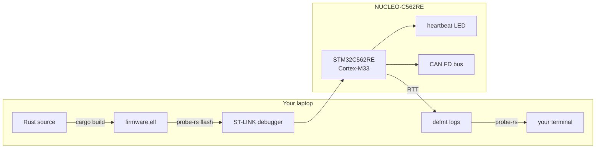

# rt-learn learning docs

Welcome. These docs exist so that a **complete Rust beginner** can understand *this
specific firmware project* — the automotive-embedded industry it targets, the Rust
language, its ecosystem, and every architectural decision baked into the repo.

You do **not** need to read five books. Read these, in order, and you will understand
what every file, dependency, and line in this repository does and *why* it is there.

Every non-obvious claim links to the **official** source so you can go deeper and so
the facts stay current. See [12-references.md](12-references.md) for the full link list.

---

## How to read this

The docs are numbered. They build on each other, so read front-to-back the first time.
Each doc is self-contained enough to revisit later as a reference.

| #  | Doc | What it teaches | Read when |
| -- | --- | --------------- | --------- |
| 00 | **[README.md](README.md)** (this file) | Map + learning path | Now |
| 01 | **[01-the-industry.md](01-the-industry.md)** | What automotive / safety-critical embedded *is*, and why Rust | First — sets the "why" |
| 02 | **[02-rust-for-beginners.md](02-rust-for-beginners.md)** | The Rust language from zero: ownership, borrowing, traits, `Result`, `async` | You've never written Rust |
| 03 | **[03-embedded-rust.md](03-embedded-rust.md)** | `no_std`, `no_main`, cross-compilation, memory, linking, panics | To understand "bare metal" |
| 04 | **[04-async-and-embassy.md](04-async-and-embassy.md)** | `async`/`await`, futures, the executor, the Embassy framework | To understand the task model |
| 05 | **[05-the-hardware.md](05-the-hardware.md)** | Arm Cortex-M33, the STM32C562RE, GPIO, clocks, interrupts, DMA | To understand the chip |
| 06 | **[06-can-and-canfd.md](06-can-and-canfd.md)** | CAN and CAN FD — the automotive bus, in depth | To understand `can_fd.rs` |
| 07 | **[07-architecture.md](07-architecture.md)** | Why this repo is structured the way it is; file-by-file walkthrough | To connect it all |
| 08 | **[08-dependencies.md](08-dependencies.md)** | Every dependency: what it is, why we need it, how it works | To understand `Cargo.toml` |
| 09 | **[09-toolchain-build-flash.md](09-toolchain-build-flash.md)** | Toolchain, build, linking, flashing, `defmt`/RTT logging | To build & run on hardware |
| 10 | **[10-quality-gates.md](10-quality-gates.md)** | Clippy, rustfmt, cargo-deny, CI, reproducible builds | To understand "production-grade" |
| 11 | **[11-glossary.md](11-glossary.md)** | Every acronym and term, defined | Whenever you hit a new word |
| 12 | **[12-references.md](12-references.md)** | All official documentation links | Whenever you want the source |

---

## The 60-second summary of this project

This firmware runs on a **NUCLEO-C562RE** dev board (an **STM32C562RE** microcontroller
with an **Arm Cortex-M33** core). It does two things at once:

1. **Blinks an LED** ("heartbeat") to prove the system is alive.
2. **Speaks CAN FD** — the communication bus used in cars — transmitting one frame per
   second and logging any frames it receives.

It is written in **`async` Rust** on the **Embassy** framework, with an uncompromising
quality bar: a pinned compiler, strict linting, supply-chain auditing, and a green CI
gate. The point is not the blinking LED — it is to learn *how real embedded firmware is
built in industry*.

---

## A note on trust and sources

These docs are written against the **exact versions this repo pins** (see
[08-dependencies.md](08-dependencies.md)). Embedded Rust moves fast; when in doubt,
the linked official docs win. If you find a discrepancy, the code + `Cargo.lock` are
the ground truth for *this* project, and the official docs are the ground truth for
*the ecosystem*.
